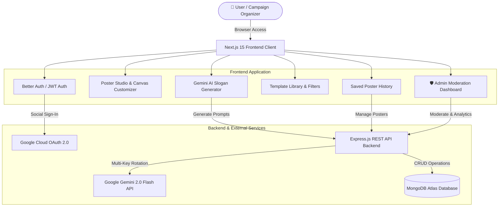

# 🇧🇩 AI Political Poster Maker — Digital Campaign & Poster Studio

<div align="center">

### **Bangladesh's First AI-Powered Digital Political & Campaign Poster Creation Platform**
*Design high-resolution, 300 DPI print-ready political, election, and commemorative posters in minutes with Gemini AI slogan generation, real-time canvas editing, and rich Bengali typography.*

[-00C7B7?style=for-the-badge&logo=vercel&logoColor=white)](https://ai-political-poster-maker-frontend-xi.vercel.app/)
[-000000?style=for-the-badge&logo=vercel&logoColor=white)](https://ai-political-poster-maker-backend-nine.vercel.app/)
[](https://nextjs.org/)
[](https://www.typescriptlang.org/)
[](https://tailwindcss.com/)
[](https://deepmind.google/technologies/gemini/)

[Explore Live Demo](https://ai-political-poster-maker-frontend-xi.vercel.app/) • [Poster Studio](https://ai-political-poster-maker-frontend-xi.vercel.app/studio) • [Template Gallery](https://ai-political-poster-maker-frontend-xi.vercel.app/templates) • [Admin Dashboard](https://ai-political-poster-maker-frontend-xi.vercel.app/admin)

</div>

---

## 🌟 Key Features

### 1. 🎨 Real-Time Interactive Poster Studio
- **Live Canvas Rendering**: Instant preview of text headlines, subtitles, designated candidate details, party logos, and leadership banners.
- **Photo Upload & Frame Adjuster**: Upload and position candidate portraits with scale, rotation, and aspect ratio controls.
- **Multi-Party Presets**: Color schemes, party symbols, and leadership photo placements for major political parties, independent candidates, and national commemorative events.

### 2. 🤖 Google Gemini AI Political Slogan & Speech Generator
- Context-aware slogan generation tailored to specific occasions (Elections, National Days, Party Conventions, Eid Greetings).
- **Bangla Speech-to-Text (Voice Recognition)**: Dictate prompts directly using microphone input.
- **1-Click Apply**: Automatically transfer AI-generated headlines and slogans onto the canvas.

### 3. 📐 10+ Pixel-Perfect Ready-to-Use Templates
- Curated election and celebration poster designs.
- Category filtering with responsive, swipeable tabs on mobile.

### 4. 🖨️ 300 DPI High-Resolution Export
- High-fidelity export options in **PNG**, **JPEG**, and **300 DPI Print-Ready PDF** for professional offset press printing.

### 5. 🛡️ Content Policy & Admin Moderation Panel
- Prohibited party symbols and hate-speech filtering.
- Admin dashboard to inspect, approve, or flag user-generated posters with real-time statistics.

### 6. 🔒 Authentication & 1-Click Evaluation Login
- **Better Auth Integration**: Google 1-Click Social Sign-In.
- **JWT Authentication**: Secure registration and login flow.
- **1-Click Admin Demo Login**: Instant access for evaluation and demonstration.

### 7. 🌓 Dark / Light Mode & 100% Mobile Responsive
- Optimized for desktop, tablet, and mobile displays.

---

## 🛠️ Technology Stack

| Layer | Technology | Purpose |
|---|---|---|
| **Frontend Framework** | Next.js 15.3 (App Router) | SSR, SSG & Fast Client Navigation |
| **Language** | TypeScript | Strong typing & robust architecture |
| **Styling** | TailwindCSS + CSS Variables | Responsive design system & Dark/Light theming |
| **Canvas Engine** | HTML5 Canvas + html2canvas | Real-time graphics rendering & high-res export |
| **AI Integration** | Google Gemini 2.0 Flash REST API | Automated political slogans & campaign copywriting |
| **Authentication** | Better Auth + JWT | Google OAuth & Credential Auth |
| **Icons** | Lucide React | Lightweight vector icons |
| **Notifications** | React Toastify | User action feedback |
| **Backend API** | Express.js / Node.js + MongoDB Atlas | Persistent storage, history, and moderation API |
| **Deployment** | Vercel | Global Edge CDN & CI/CD deployment |

---

## 🏗️ System Architecture



---

## 🚀 Local Development Setup

### 1. Clone the Repository
```bash
git clone https://github.com/Saad7528/ai-political-poster-maker-frontend.git
cd ai-political-poster-maker-frontend
```

### 2. Install Dependencies
```bash
npm install
```

### 3. Environment Variables Configuration (`.env.local`)
Create a `.env.local` file in the root directory:

```env
# Backend REST API
NEXT_PUBLIC_API_URL=http://localhost:5000/api

# Better Auth Configuration (Google Social Login)
BETTER_AUTH_URL=http://localhost:3000
BETTER_AUTH_SECRET=rise_together_political_poster_maker_super_secure_jwt_secret_2026_bd

# Google OAuth Credentials
GOOGLE_CLIENT_ID=your_google_client_id_here
GOOGLE_CLIENT_SECRET=your_google_client_secret_here
```

### 4. Run Development Server
```bash
npm run dev
```
Open [http://localhost:3000](http://localhost:3000) in your browser.

### 5. Production Build
```bash
npm run build
npm run start
```

---

## 📁 Project Directory Structure

```
frontend/
├── public/                     # Static assets (favicons, fonts, symbols)
├── src/
│   ├── app/                    # Next.js App Router pages
│   │   ├── admin/              # 🛡️ Admin moderation dashboard
│   │   ├── api/auth/           # Better Auth route handlers
│   │   ├── auth/               # 🔐 Clean standalone sign-in / registration
│   │   ├── history/            # 📂 Saved user posters gallery
│   │   ├── studio/             # 🎨 Main interactive poster editor
│   │   ├── templates/          # 🖼️ Ready-to-use template library
│   │   ├── layout.tsx          # Root layout with fonts & metadata
│   │   └── page.tsx            # Landing hero & feature showcase
│   ├── components/
│   │   ├── layout/             # Navbar, Footer & Theme Provider
│   │   ├── poster/             # PosterCanvas, Controls, AISloganGenerator
│   │   └── ui/                 # ConfirmModal, Loaders & Preview Cards
│   ├── context/                # AuthContext, ThemeContext
│   ├── lib/                    # API client, Better Auth client & helpers
│   └── types/                  # TypeScript interfaces & data contracts
├── tailwind.config.ts          # Tailwind CSS theme extension
├── tsconfig.json               # TypeScript compiler config
└── package.json                # Project dependencies and build scripts
```

---

## 🛡️ Admin Demo Access

- **Email**: `admin@politicalposter.bd`
- **Password**: `Admin12345!`
- *Or click the "🛡️ 1-Click Admin Demo Login" button on the login page.*

---

## 🎯 Project Context & Evaluation Details

> **Note**: This project was developed by **[S. M. Amirul Islam Saad](https://github.com/Saad7528)** as part of the technical assessment and practical evaluation for the **Full Stack Developer** position at **[Rise Together](https://risetogetherbd.com/)**.

### 📋 Assessment Summary
| Parameter | Details |
|---|---|
| **Challenge Name** | AI Political Poster Maker |
| **Target Role** | Full Stack Developer |
| **Company** | [Rise Together](https://risetogetherbd.com) |
| **Candidate** | S. M. Amirul Islam Saad |
| **Submission Deadline** | 10/4/2026, 11:59:00 PM |
| **Status** | ✅ Completed, Verified & Deployed |
| **Frontend Live URL** | [https://ai-political-poster-maker-frontend-xi.vercel.app](https://ai-political-poster-maker-frontend-xi.vercel.app/) |
| **Backend API Live URL** | [https://ai-political-poster-maker-backend-nine.vercel.app](https://ai-political-poster-maker-backend-nine.vercel.app/) |

---

## 📄 License

This project is licensed under the [MIT License](LICENSE).
