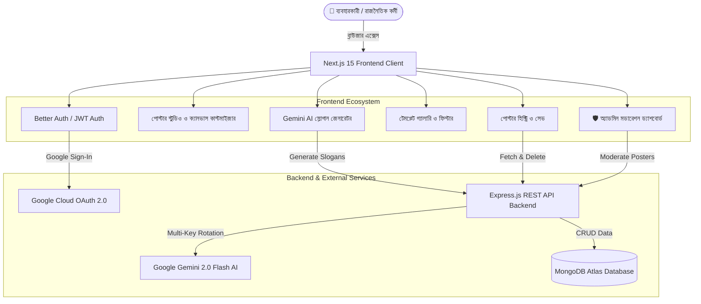

# 🇧🇩 ডিজিটাল পোস্টারমেকার — AI Political & Election Poster Maker

<div align="center">


### **বাংলাদেশের প্রথম এআই চালিত ডিজিটাল রাজনৈতিক ও নির্বাচনী পোস্টার ক্রিয়েটর প্ল্যাটফর্ম**
*Design high-resolution, print-ready (300 DPI) political, commemorative, and campaign posters in minutes with Gemini AI slogan generation, dynamic canvas customization, and rich Bengali typography.*

[-00C7B7?style=for-the-badge&logo=vercel&logoColor=white)](https://ai-political-poster-maker-frontend-xi.vercel.app/)
[-000000?style=for-the-badge&logo=vercel&logoColor=white)](https://ai-political-poster-maker-backend-nine.vercel.app/)
[](https://nextjs.org/)
[](https://www.typescriptlang.org/)
[](https://tailwindcss.com/)
[](https://deepmind.google/technologies/gemini/)

[লাইভ ডেমো দেখুন](https://ai-political-poster-maker-frontend-xi.vercel.app/) • [পোস্টার স্টুডিও](https://ai-political-poster-maker-frontend-xi.vercel.app/studio) • [টেমপ্লেট গ্যালারি](https://ai-political-poster-maker-frontend-xi.vercel.app/templates) • [অ্যাডমিন প্যানেল](https://ai-political-poster-maker-frontend-xi.vercel.app/admin)

</div>

---

## 🌟 মূল বৈশিষ্ট্যসমূহ (Key Features)

### 1. 🎨 রিয়েল-টাইম পোস্টার কাস্টমাইজার ও ক্যানভাস (Interactive Poster Studio)
- **লাইভ প্রিভিউ ও ইনস্ট্যান্ট রেন্ডারিং**: টেক্সট, স্লোগান, ফন্ট সাইজ ও লেআউট পরিবর্তনের সাথে সাথে ক্যানভাসে রিয়েল-টাইম আপডেট।
- **ছবি আপলোড ও ফ্রেম অ্যাডজাস্টমেন্ট**: প্রার্থী ও শীর্ষ নেতার ছবি আপলোড, ড্র্যাগ, রিসাইজ ও রোটেশন সুবিধা।
- **বহুদলীয় রাজনৈতিক প্রতীক ও থিম**: আওয়ামী লীগ, বিএনপি, জামায়াত, জাতীয় পার্টি, ইসলামী আন্দোলনসহ স্বতন্ত্র ও জাতীয় উৎসবের জন্য আলাদা কালার স্কিম ও দলীয় প্রতীক।

### 2. 🤖 গুগল জেমিনি এআই স্লোগান ও বক্তব্য জেনারেটর (Gemini AI Integration)
- প্রার্থী, পদবী, এলাকা (জেলা, থানা/ইউনিয়ন) এবং উপলক্ষের উপর ভিত্তি করে শক্তিশালী নির্বাচনী ও রাজনৈতিক স্লোগান তৈরি।
- **বাংলা ভয়েস টাইপিং (Speech-to-Text)**: সরাসরি মুখে কথা বলে স্লোগান প্রম্পট দেওয়ার সুবিধা।
- **১-ক্লিক অ্যাপ্লাই**: পছন্দের এআই স্লোগানটিতে ক্লিক করলেই তা সাথে সাথে পোস্টার ব্যানারে সেট হয়ে যায়।

### 3. 📐 রেডিমেড প্রফেশনাল টেমপ্লেট লাইব্রেরি (Ready-to-Use Templates)
- ১০+ হাই-কোয়ালিটি টেমপ্লেট: সাধারণ নির্বাচন, জাতীয় সংসদ, ঈদ শুভেচ্ছা, স্বাধীনতা দিবস, বিজয় দিবস, একুশে ফেব্রুয়ারি, সম্মেলন ইত্যাদি।
- ক্যাটাগরি অনুযায়ী ফিল্টারিং এবং মোবাইল ফ্রেন্ডলি সোয়াইপেবল ট্যাব বার।

### 4. 🖨️ আল্ট্রা হাই-রেজুলেশন প্রিন্ট এক্সপোর্ট (300 DPI Export)
- ডিজিটাল প্রচারের জন্য **PNG** / **JPEG** এবং সরাসরি প্রেসে প্রিন্ট করার জন্য **৩০০ DPI প্রিন্ট-রেডি PDF** এক্সপোর্ট।

### 5. 🛡️ অ্যাডমিন মডারেশন ড্যাশবোর্ড ও কন্টেন্ট পলিসি (Admin Moderation Panel)
- নিষিদ্ধ দলীয় প্রতীক, সংবেদনশীল শব্দ ও হেট-স্পিচ প্রিভেনশন।
- ইউজারভিত্তিক পোস্টার পর্যবেক্ষণ, অনুমোদন (Approve) ও ফ্ল্যাগ (Flag) করার সম্পূর্ণ অ্যাডমিন কন্ট্রোল।
- প্ল্যাটফর্মের রিয়েল-টাইম ইউজার, পোস্টার ও জেনারেশন অ্যানালিটিক্স।

### 6. 🔒 সিকিউর অথেন্টিকেশন ও ওয়ান-ক্লিক অ্যাডমিন টেস্ট (Auth & Security)
- **Better Auth Integration**: ১-ক্লিকে গুগল অ্যাকাউন্ট দিয়ে সোশ্যাল সাইন-ইন।
- **JWT সিকিউর লগইন / রেজিস্ট্রেশন**: পাসওয়ার্ড হ্যাশিং ও রেসপন্সিভ অথ কার্ড।
- **১-ক্লিক অ্যাডমিন ডেমো লগইন**: টেস্ট ও ইভালুয়েশনের জন্য সরাসরি এক ক্লিকে অ্যাডমিন প্যানেল এক্সেস।

### 7. 🌓 ডার্ক ও লাইট মোড + ১০০% মোবাইল রেসপনসিভ
- চোখের স্বস্তির জন্য প্রিমিয়াম ডার্ক এবং লাইট থিম সাপোর্ট।
- স্মার্টফোন, ট্যাবলেট এবং বড় মনিটরে চমৎকারভাবে অপ্টিমাইজড UI।

---

## 🛠️ টেকনোলজি স্ট্যাক (Technology Stack)

| স্তর | টেকনোলজি | ব্যবহার |
|---|---|---|
| **Core Framework** | Next.js 15.3 (App Router) | SSR, SSG ও ফাস্ট ক্লায়েন্ট রাউটিং |
| **Language** | TypeScript | টাইপ সেফটি ও ক্লিন আর্কিটেকচার |
| **Styling** | TailwindCSS + Vanilla CSS | কাস্টম ডিজাইন সিস্টেম ও রেসপনসিভনেস |
| **Canvas Rendering** | HTML5 Canvas + Fabric.js & html2canvas | হাই-রেজুলেশন পোস্টার রেন্ডারিং ও এক্সপোর্ট |
| **Icons** | Lucide React | মডার্ন লাইটওয়েট ভেক্টর আইকন |
| **Notifications** | React Toastify | ইন্টারঅ্যাক্টিভ ইউজার নোটিফিকেশন |
| **AI Engine** | Google Gemini 2.0 Flash REST API | পলিটিক্যাল স্লোগান ও কন্টেন্ট জেনারেশন |
| **Authentication** | Better Auth + JWT Token | গুগল OAuth ও কাস্টম অথেন্টিকেশন |
| **Backend API** | Node.js / Express.js + MongoDB | ডাটাবেজ, হিস্ট্রি ও অ্যাডমিন কন্ট্রোল |
| **Deployment** | Vercel | গ্লোবাল এজ সিডিএন ও সিআই/সিডি অটোমেশন |

---

## 🏗️ সিস্টেম আর্কিটেকচার (System Architecture)



---

## 🚀 লোকাল সেটআপ গাইড (Local Development Setup)

### ১. রিপোজিটরি ক্লোন করুন
```bash
git clone https://github.com/Saad7528/ai-political-poster-maker-frontend.git
cd ai-political-poster-maker-frontend
```

### ২. ডিপেন্ডেন্সি ইনস্টল করুন
```bash
npm install
```

### ৩. এনভায়রনমেন্ট ভ্যারিয়েবল কনফিগারেশন (`.env.local`)
রুট ডিরেক্টরিতে `.env.local` ফাইল তৈরি করুন এবং নিচের মানগুলো বসান:

```env
# Backend REST API URL
NEXT_PUBLIC_API_URL=http://localhost:5000/api

# Better Auth Configuration (Google Social Login)
BETTER_AUTH_URL=http://localhost:3000
BETTER_AUTH_SECRET=rise_together_political_poster_maker_super_secure_jwt_secret_2026_bd

# Google OAuth Client Credentials
GOOGLE_CLIENT_ID=your_google_client_id_here
GOOGLE_CLIENT_SECRET=your_google_client_secret_here
```

### ৪. ডেভেলপমেন্ট সার্ভার চালু করুন
```bash
npm run dev
```
ব্রাউজারে [http://localhost:3000](http://localhost:3000) ওপেন করে প্রজেক্টটি উপভোগ করুন।

### ৫. প্রোডাকশন বিল্ড তৈরি করুন
```bash
npm run build
npm run start
```

---

## 📁 ফোল্ডার স্ট্রাকচার (Project Directory Structure)

```
frontend/
├── public/                     # স্ট্যাটিক অ্যাসেটস (লোগো, আইকন, ফন্টস)
├── src/
│   ├── app/                    # Next.js App Router পেজসমূহ
│   │   ├── admin/              # 🛡️ অ্যাডমিন মডারেশন প্যানেল
│   │   ├── api/auth/           # Better Auth API হ্যান্ডলার
│   │   ├── auth/               # 🔐 সাইন ইন / রেজিস্ট্রেশন পেজ
│   │   ├── history/            # 📂 সংরক্ষিত পোস্টার হিস্ট্রি
│   │   ├── studio/             # 🎨 মূল পোস্টার ডিজাইন স্টুডিও
│   │   ├── templates/          # 🖼️ টেমপ্লেট গ্যালারি
│   │   ├── layout.tsx          # গ্লোবাল লেআউট ও মেটাডাটা
│   │   └── page.tsx            # ল্যান্ডিং ও ফিচার হোমপেজ
│   ├── components/
│   │   ├── layout/             # ন্যাভবার, ফুটার ও থিম প্রোভাইডার
│   │   ├── poster/             # ক্যানভাস, কন্ট্রোলস, এআই স্লোগান প্যানেল
│   │   └── ui/                 # কনফার্ম মোডাল, লোডার ও প্রিভিউ কার্ড
│   ├── context/                # AuthContext, ThemeContext
│   ├── lib/                    # API ক্লায়েন্ট, Better Auth ক্লায়েন্ট ও ইউটিলিটি
│   └── types/                  # TypeScript ইন্টারফেস ও ডাটা মডেল
├── tailwind.config.ts          # টেইলউইন্ড সিএসএস কনফিগারেশন
├── tsconfig.json               # টাইপস্ক্রিপ্ট কনফিগারেশন
└── package.json                # প্রজেক্ট ডিপেন্ডেন্সি ও স্ক্রিপ্ট
```

---

## 🛡️ অ্যাডমিন ড্যাশবোর্ড ক্রেডেনশিয়াল (Admin Demo Access)

- **ইমেইল**: `admin@politicalposter.bd`
- **পাসওয়ার্ড**: `Admin12345!`
- **অথবা**: লগইন পেজে থাকা `🛡️ অ্যাডমিন টেস্ট লগইন (১-ক্লিক)` বাটনে ক্লিক করে সরাসরি এক্সেস করুন।

---

## 👨‍💻 অবদান ও ক্রেডিট (Author & Credits)

- **প্রজেক্ট নাম**: AI Political Poster Maker (ডিজিটাল পোস্টারমেকার)
- **উন্নয়নে**: [S. M. Amirul Islam Saad](https://github.com/Saad7528)
- **লাইসেন্স**: MIT License (সকলের জন্য উন্মুক্ত)

---

<div align="center">
  <sub>দেশপ্রেম, নির্ভুল বাংলা টাইপোগ্রাফি ও আধুনিক প্রযুক্তির সমন্বয়ে নির্মিত ❤️</sub>
</div>
